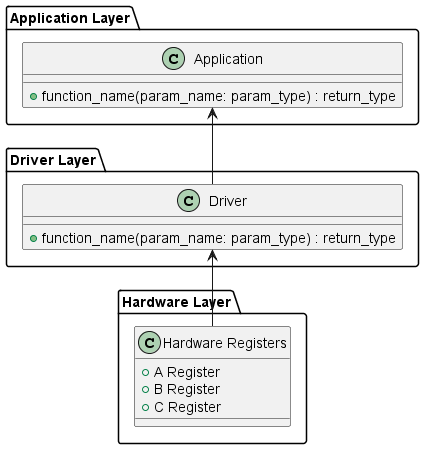
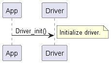
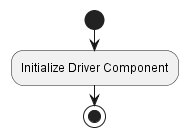
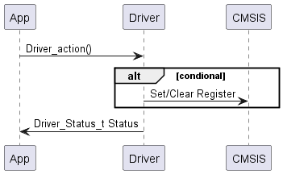
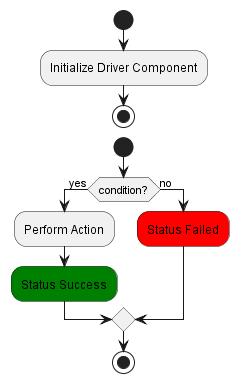
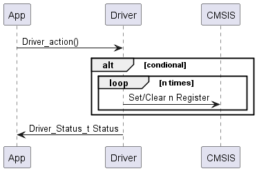
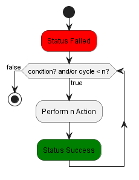
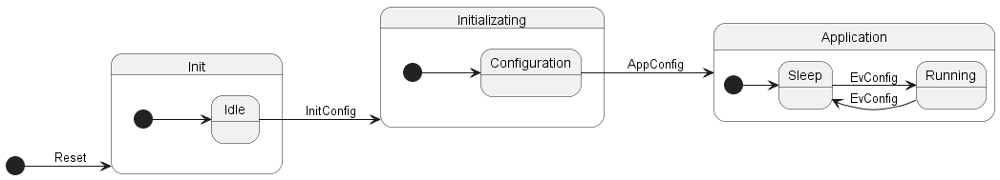

---

# Software Design Document (SDD)
**Module:** `DRIVER_NAME` Driver  
**Version:** `VERSION`  
**Author:** `AUTHORS_NAMES`

---

## 1. Introduction
### 1.1. Purpose  
This document describes the design and architecture of the `DRIVER_NAME` driver module, based on the requirements defined in the SRS. It provides details on data structures, algorithms, and control flow to guide implementation and testing.

### 1.2. Scope  
The `DRIVER_NAME` driver is a low-level software component for embedded systems. It abstracts hardware registers and provides a clean API for higher-level modules to `BASIC_DESCRIPTION_OF_THE_DRIVER`.

### 1.3. Definitions, Acronyms, and Abbreviations 
| **Term**      | **Definition**  |
| ------------- | --------------- |
| e.g., GPIO    |  General Purpose Input/Output   |
|               |                 |

### 1.4. Requirements  
All requirements specific to his module are allocated in `PATH_TO_THE_DRIVER_SRS`.

---

## 2. System Architecture
### 2.1. High-Level Design  
- **Layered Architecture:**  
  - **Application Layer:** Calls `DRIVER_NAME` driver functions.  
  - **`DRIVER_NAME` Driver Layer:** Provides APIs (`DRIVER_NAME_init`, etc.).
  - **Hardware Layer:** Actual microcontroller `DRIVER_NAME` registers.  

### 2.2. Module Interfaces  
- **Public API:** Functions defined in `DRIVER_NAME.h`. 
- **Dependencies:** MCU-specific register definitions (`CMSIS_DEFINE_EXAMPLES`, etc.), another module drivers (`GPIO_DRIVER`, `TIMER_DRIVER`, etc.).  

---

## 3. Detailed Design
### 3.1. Class Diagram
<figure>

<figcaption>Figure 1. Class Diagram - Driver
</figure>

### 3.2. Module Behavior (Sequence Diagrams, State Machines, etc.)
<figure>

<figcaption>Figure 2. Sequence Diagram - Driver Init
</figure>

<figure>

<figcaption>Figure 3. Activity Diagram - Driver Init
</figure>

<figure>

<figcaption>Figure 4. Sequence Diagram - Driver Action with Conditional
</figure>

<figure>

<figcaption>Figure 5. Activity Diagram - Driver Action with Conditional
</figure>

<figure>

<figcaption>Figure 6. Sequence Diagram - Driver Action with Loop
</figure>

<figure>

<figcaption>Figure 7. Activity Diagram - Driver Action with Loop
</figure>

<figure>

<figcaption>Figure 8. State Diagram - Driver
</figure>

### 3.3. `DRIVER_NAME` Driver
Explain in detail what the driver does, referencing the diagrams above to help the developer understand the logic of the design.

---

## 4. Application Programming Interfaces

### 4.1. Data Types and Macros
- **`data_type`:** This `data_type` represents a specific type of values used in this driver for this specific function.  
- **`structure_type`:** This `structure_type` contains the following configuration for this specific function.

   | **Member Name** | **Type**  | **Notes/Definition**  |
   | -------------   | --------------- | --------------- |
   | e.g., idx       |  uint8_t   | Device driver index. |
   |                 |                 |                 |
- **`macro_name`:** This `macro_name` represents a specific value within this driver for this specific reason. The `macro_name` value is `macro_value`.

### 4.2. Error Codes
The `DRIVER_NAME` APIs have a return type of the `data_type` error code. Error codes relevant to this module are listed below. 

   | **Code** | **Notes/Definition**  |
   | -------------   | --------------- |
   | e.g., DRIVER_STATUS_E_OK | 0x00 - Operation was successful. |
   |                 |                 |

### 4.3. Function Definitions
#### Function Name (e.g., `driver_init`)
   
|  |  |  |
| -------------   | --------------- | --------------- |
| **Function Name** | Function name (e.g., driver_init) |
| **Syntax** | Function declaration (e.g., `void driver_init(void)`) |
| **Parameters (in)** | Name of input parameters | Brief description of input parameters. |
| **Parameters (inout)** | Name of parameters used as input and output in the function (e.g., a pointer whose initial value is used) | Brief description of inout parameters. |
| **Parameters (out)** | Name of output parameters (e.g., a pointer whose initial value is not used) | Brief description of output parameters. |
| **Return value** | Data type of the return value | Brief description of return value and/or possible return values. |
| **Description** | Brief description of the function's purpose. |
| **Constraints** | List any constraint found in the function (e.g., it does not return the real reason why the operation failed) |
| **Available via** | Header file where the function is declared (e.g., `DRIVER_NAME.h`) |

### 4.4. Internal Function Definitions
#### Function Name (e.g., `driver_init`)
   
|  |  |  |
| -------------   | --------------- | --------------- |
| **Function Name** | Function name (e.g., driver_init) |
| **Syntax** | Function declaration (e.g., `void driver_init(void)`) |
| **Parameters (in)** | Name of input parameters | Brief description of input parameters. |
| **Parameters (inout)** | Name of parameters used as input and output in the function (e.g., a pointer whose initial value is used) | Brief description of inout parameters. |
| **Parameters (out)** | Name of output parameters (e.g., a pointer whose initial value is not used) | Brief description of output parameters. |
| **Return value** | Data type of the return value | Brief description of return value and/or possible return values. |
| **Description** | Brief description of the function's purpose. |
| **Constraints** | List any constraint found in the function (e.g., it does not return the real reason why the operation failed) |

---

## 5. Future Enhancements
- List any future enhancements that may be needed soon.  

---
